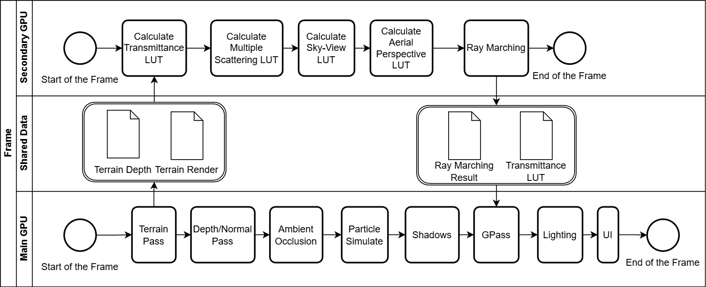
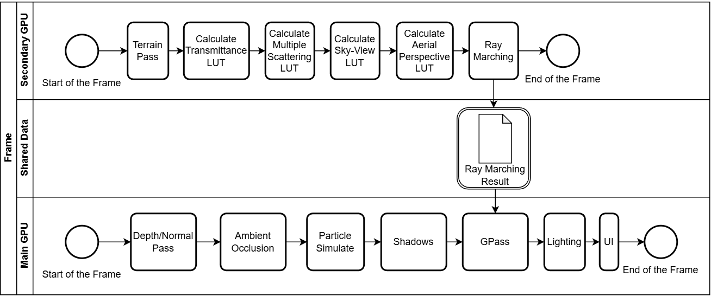
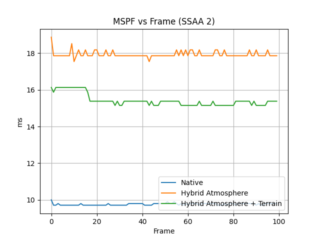

# DX12

This project is my master's thesis. Developed in collaboration with ITMO (https://itmo.ru/ru/) and Sperasoft (https://sperasoft.ru/) https://docs.google.com/presentation/d/16dh4ahcwjb1cMhcog0ikniztRQmwZcg1qDvM6XA27mo/edit#slide=id.p1

This project was taken as the basis for the graphics engine developed in the team. https://github.com/Pepengineers

Several interaction algorithms have been implemented:

## Shared Shadow Map

### Result

## Shared User Interface Blending

### Result

## Shared Particle System

## Shared Hybrid Compute

### Result with full shared

### Result with scaled resource

## Shared Atmosphere Rendering

Implementation of a real-time atmosphere rendering algorithm based on the method proposed by Sébastien Hillaire (2020) using DirectX 12 and Explicit Multi-Adapter (EMA).

The algorithm uses several precomputed lookup tables:
- Transmittance LUT
- Multi Scattering LUT
- Sky View LUT
- Aerial Perspective LUT

The project also includes terrain rendering with a depth buffer to demonstrate the aerial perspective effect.

### Multi-GPU Configurations

#### Hybrid Atmosphere
Atmosphere passes are computed on the secondary GPU, while terrain rendering and final scene composition are performed on the primary GPU.

#### Hybrid Atmosphere + Terrain
Both terrain rendering and atmosphere passes are executed on the secondary GPU. The primary GPU performs only the final scene composition.

### Rendering Pipeline

1. Terrain rendering + depth buffer generation
2. Transmittance LUT pass
3. Multi Scattering LUT pass
4. Sky View LUT pass
5. Aerial Perspective LUT pass
6. Final ray marching
7. Tonemapping and scene composition

### Results

For the project you need:
 1. Windows SDK 19041 version
 2. Internet for restore Nuget packages
 3. More then one GPU (and/or iGPU/dGPU)
 
Steps for build:
  1. Restore Submodule
  2. Restore Nuget packages
  3. Build any Sample and Copy 'Data' and 'Shaders' folder to build directory
